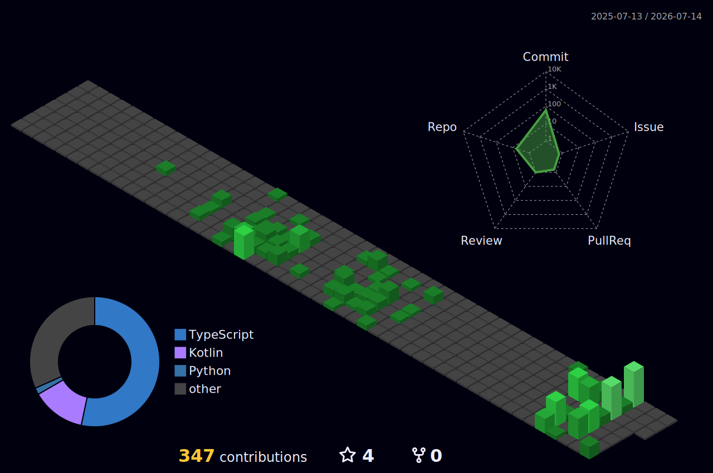

<!-- ============================================================ -->
<!--   LUISANGEL PARRA · GitHub Profile README · v3               -->
<!--   Theme: terminal / indigo + cyan                            -->
<!--   NOTE: stat dashboard + 3D graph are static SVGs generated  -->
<!--   by the workflows in .github/workflows/ (setup steps inside).-->
<!-- ============================================================ -->

<!-- ─────────────────────────  HERO  ───────────────────────── -->
<p align="center">
  
</p>

<!-- ────────────────────────  BADGES  ──────────────────────── -->
<p align="center">
  
  
  
</p>

<p align="center">
  <em>"Translating abstract data into systems that work — across continents."</em>
</p>

---

## `~/whoami`

```python
luisangel = {
    "role":      "Software Engineer (in training)",
    "studying":  ["BSc Systems Engineering", "MSc Global Software Development"],
    "based_in":  "Colombia 🇨🇴  ↔  Germany 🇩🇪",
    "from":      "Venezuela 🇻🇪",
    "focus":     ["Backend", "Machine Learning", "DevOps"],
    "learning":  "Deutsch (B1 → B2)",
    "loves":     "international teams + turning complex ideas into clear words",
}
```

Tengo una misión clara: **desbloquear el poder de los datos para crear sistemas que no solo sean *inteligentes*, sino *útiles***. Mi desarrollo profesional se nutre del recorrido entre **Venezuela, Colombia y Alemania**, donde combino mis estudios superiores con el desarrollo de software Backend, Machine Learning y DevOps. Disfruto el trabajo en equipos internacionales y simplificar conceptos técnicos complejos en palabras claras.

<p align="center">
  
  
  
</p>

---

## `~/skills --list`

<p align="center">
  
</p>

<table align="center">
  <tr><td align="center"><b>Languages</b></td><td>Python · Java · JavaScript · TypeScript</td></tr>
  <tr><td align="center"><b>Backend</b></td><td>Node.js · Express · Spring · Nginx</td></tr>
  <tr><td align="center"><b>Data</b></td><td>MySQL · PostgreSQL</td></tr>
  <tr><td align="center"><b>Frontend</b></td><td>React · Next.js · Astro · Tailwind</td></tr>
  <tr><td align="center"><b>DevOps</b></td><td>Docker · Git</td></tr>
</table>

---

## `~/stats`

<p align="center">
  
</p>

<!-- =================================================================
     UNIFIED METRICS DASHBOARD  (languages · habits · achievements ·
     contribution calendar). This is the reliable replacement for the
     github-readme-stats cards that were returning 502.

     HOW TO TURN IT ON:
       1. Add .github/workflows/metrics.yml (provided).
       2. Create a classic PAT and save it as repo secret METRICS_TOKEN.
       3. Run the workflow once (Actions tab → Run workflow).
       4. It commits a static `metrics.svg` to this repo.
       5. Delete the comment markers around the block below.
================================================================= -->
<!--
<p align="center">
  
</p>
-->

<!-- =================================================================
     3D CONTRIBUTION GRAPH
       1. Add .github/workflows/profile-3d.yml (provided).
       2. Run it once. It commits SVGs to `profile-3d-contrib/`.
       3. Confirm the exact committed path + your default branch,
          then update the src below and uncomment.
================================================================= -->
<!--
<p align="center">
  
</p>
-->

---

## `~/connect`

<p align="center">
  <a href="https://www.linkedin.com/in/luisangel-parra">
    
  </a>
  <a href="mailto:hello@luisangelparra.com">
    
  </a>
</p>

<!-- ────────────────────────  FOOTER  ──────────────────────── -->
<p align="center">
  
</p>
